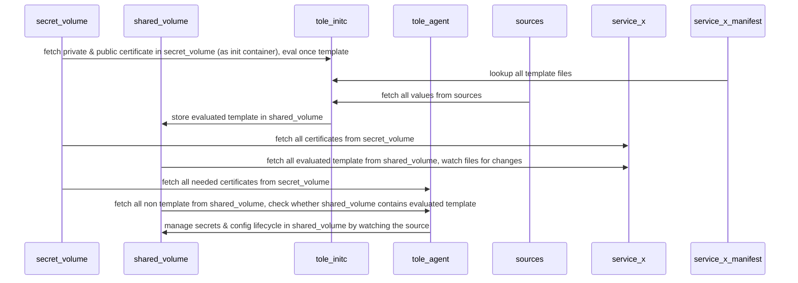

#### `tole` Kubernetes Flow

```mermaid
sequenceDiagram
  participant secret_volume
  participant shared_volume
  participant tole_initc
  participant tole_agent
  participant sources
  participant service_x
  participant service_x_manifest

  secret_volume ->> tole_initc  : fetch private & public certificate in secret_volume (as init container), eval once template
  service_x_manifest ->> tole_initc : lookup all template files
  sources ->> tole_initc : fetch all values from sources
  tole_initc ->> shared_volume : store evaluated template in shared_volume
  secret_volume ->> service_x : fetch all certificates from secret_volume
  shared_volume ->> service_x : fetch all evaluated template from shared_volume, watch files for changes
  secret_volume ->> tole_agent  : fetch all needed certificates from secret_volume
  shared_volume ->> tole_agent : fetch all non template from shared_volume, check whether shared_volume contains evaluated template
  tole_agent ->> shared_volume : manage secrets & config lifecycle in shared_volume by watching the source

```

[comment]: <> (this is a comment)
